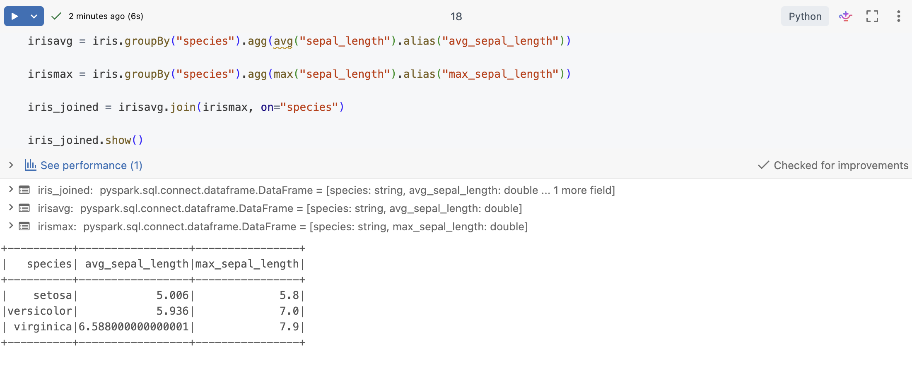
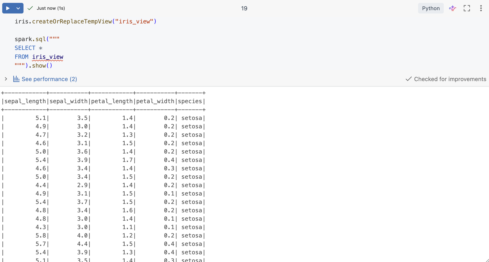
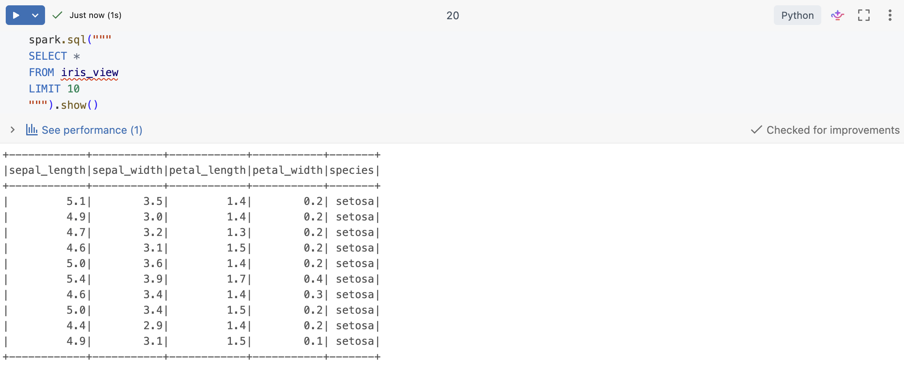

# PySpark Iris Tasks

## Task 1 - Display the Iris DataFrame

```python
iris.show()
```


---

## Task 2 - Display Data Types

```python
iris.dtypes
```


---

## Task 3 - Display Column Names

```python
iris.columns
```


---

## Task 4 - Generate Summary Statistics

```python
iris.describe().show()
```


---

## Task 5 - Select the sepal_length Column

```python
iris.select("sepal_length").show()
```


---

## Task 6 - Display Distinct Species

```python
iris.select("species").distinct().show()
```


---

## Task 7 - Drop the species Column

```python
iris_no_species = iris.drop("species")
iris_no_species.show()
```


---

## Task 8 - Filter Rows Where sepal_length > 5.5

```python
iris.filter(col("sepal_length") > 5.5).show()
```


---

## Task 9 - Filter Species Beginning with "v"

```python
iris.filter(col("species").like("v%")).show()
```


---

## Task 10 - Group by Species and Aggregate Values

```python
iris.groupBy("species").agg(
    avg("sepal_width"),
    max("sepal_length")
).show()
```


---

## Task 11 - Replace Species Names with Initials

```python
iris_initials = iris.withColumn(
    "species",
    when(col("species") == "virginica", "VI")
    .when(col("species") == "versicolor", "VE")
    .when(col("species") == "setosa", "SE")
)

iris_initials.show()
```


---

## Task 12 - Create Missing Values and Remove Null Rows

```python
irisna = iris.replace(0.2, None)

irisna.dropna().show()
```


---

## Task 13 - Create Two DataFrames and Join on species

```python
irisavg = iris.groupBy("species").agg(avg("sepal_length").alias("avg_sepal_length"))

irismax = iris.groupBy("species").agg(max("sepal_length").alias("max_sepal_length"))

iris_joined = irisavg.join(irismax, on="species")

iris_joined.show()
```



## Task 14 - Store a DataFrame as an SQL View

```python
iris.createOrReplaceTempView("iris_view")

spark.sql("""
SELECT *
FROM iris_view
""").show()
```



## Task 15 - Run a Simple SQL SELECT Query Using PySpark

```python
spark.sql("""
SELECT *
FROM iris_view
LIMIT 10
""").show()
```


